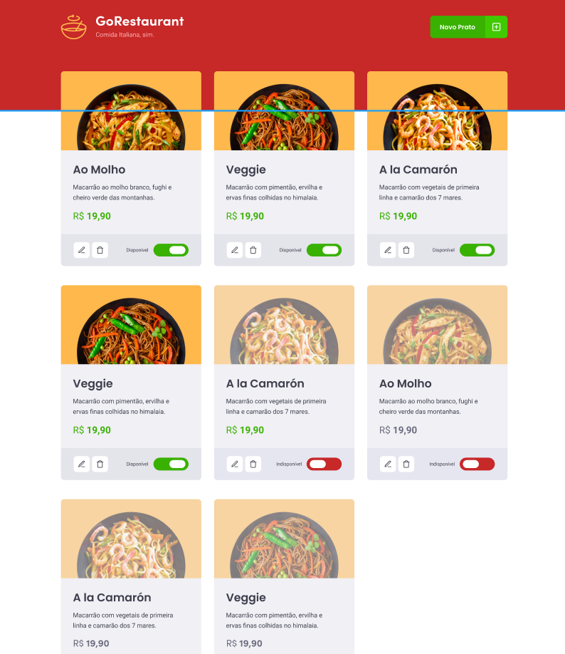
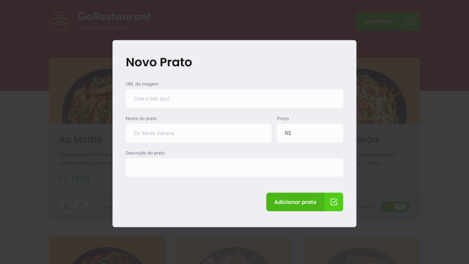

<h3 align="center">
  Desafio 10: GoRestaurant Web
</h3>

## :rocket: Sobre o desafio

Nesse desafio, usando TypeScript, foi aplicado os conceitos de CRUD (Create, Read, Update, Delete) com ReactJS e foi desenvolvido a aplicação GoRestaurant, essa será uma aplicação que irá se conectar a uma fake API, e exibir os pratos de comida criados e permitir a criação, remoção e atualização desses pratos.

Telas da aplicação:

    
    

